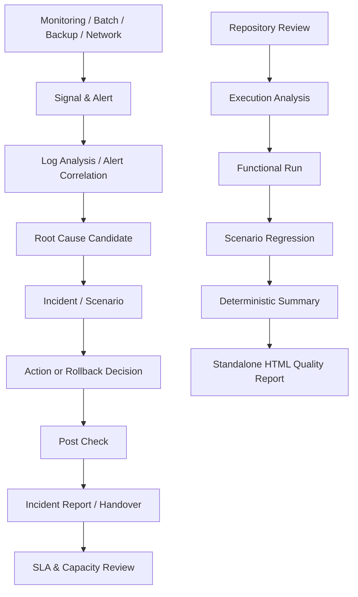

# DAOUTECH_IDC Architecture

## 목적

이 저장소는 IDC/데이터센터 운영에서 반복되는 점검, 장애 대응, 배치 마감, 백업 검증, 네트워크 진단, 변경관리, Capacity/SLA 판단을 **실행 가능한 Python 도구 + 브라우저 시뮬레이터 + 결정적 CI 검증**으로 연결합니다.

실제 운영 시스템을 변경하는 코드는 CI에서 실행하지 않고, dry-run·임시 샌드박스·읽기 전용 조회로 검증합니다.

## 전체 흐름

## 운영 기능 계층

| 계층 | 구현 | 핵심 판단 |
|---|---|---|
| 서버/NOC | `healthcheck.py`, `noc-dashboard.html`, `server-console.html` | CPU·메모리·디스크·서비스·네트워크 상태 |
| 배치 | `batch-operations-lab.html` | 선후행, Critical Path, 재실행, SLA 마감 영향 |
| 로그/알람 | `log_analyzer.py`, `alert_correlator.py` | 로그 정규화, 급증 탐지, 다중 알람 상관분석 |
| 장애 | `incident-lab.html`, `incident_report.py` | 원인·조치·에스컬레이션·교대 인수인계 |
| 변경 | `change-management-lab.html` | 사전점검, Post Check, Rollback 기준 |
| 백업 | `backup_verify.py`, `backup-simulator.html` | 존재·크기·신선도·SHA-256·복구 체인 |
| 네트워크/보안 | `network-path.html`, `linux-security-lab.html`, `cert_expiry.py` | DNS·경로·포트·권한·인증서 |
| Capacity/SLA | `disk_forecast.py`, `capacity_planner.py`, `sla_calculator.py` | 임계 도달 예상, 허용 장애시간, 가용성 |

## 결정적 품질 검증 계층

1. `tools/review_repo.py` — 구조, 문법, README 경로, Action 런타임 검사
2. `tools/run_analyze.py` — 모든 Git 추적 파일 분석 및 제출 필수 파일 검사
3. `tools/execute_repo.py` — 안전한 fixture/sandbox 기반 실제 functional 실행
4. `scenario_runner.py` — 운영 시나리오의 Root Cause·후행 영향·SLA 위험 계산
5. `tools/summarize_reports.py` — 외부 AI 없이 최종 READY/BLOCKED 집계
6. `tools/portfolio_report.py` — 모든 결과를 standalone HTML로 통합
7. `tests/` — 핵심 계산과 경계조건 회귀 테스트
8. CodeQL — Python/JavaScript 정적 보안 분석

## 교차환경 검증

GitHub Actions는 Ubuntu와 Windows에서 Python 3.12/3.13 조합을 검증합니다. 운영 도구가 OS별 분기를 가지고 있어도 핵심 로직이 동일하게 import/compile/test되는지 확인하는 목적입니다.

## 데이터와 실제 경험의 구분

`scenarios/`의 수치, 서비스명, 장애 흐름은 **포트폴리오 검증용 시뮬레이션 데이터**입니다. 실제 회사·고객 시스템의 서버명, IP, 로그, 업무 데이터는 포함하지 않습니다.
